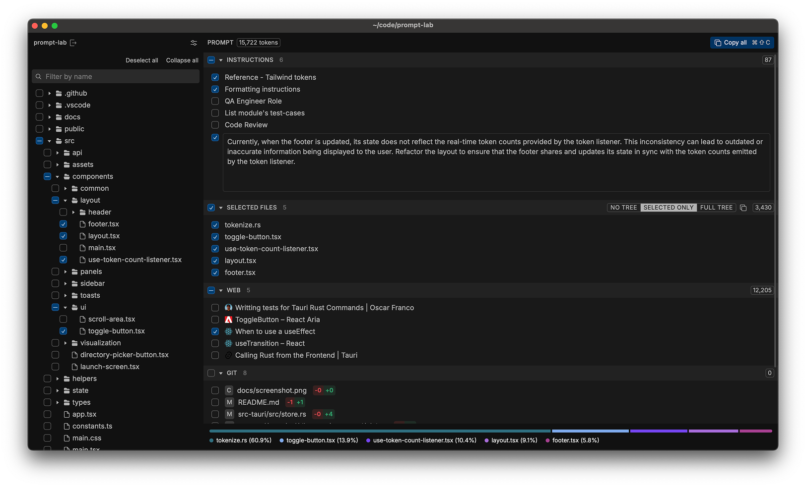

<br />
<div align="center">
  
  <h3 align="center">Prompt Lab</h3>
  <!-- <p align="center">
    <br />
    <a href="https://www.haider.dev/promptlab/download">Website</a>
    · 
    <a href="https://www.haider.dev/promptlab/download">Download</a>
    · 
    <a href="https://www.haider.dev/promptlab/docs">Explore the docs</a>
  </p> -->
</div>

Prompt Lab is an open-source, cross-platform desktop app for building and providing code-related context to large language models.

## Features

- Share project directory structure with LLMs
- Embed full file contents in prompts
- Enable LLMs to review Git diffs for code changes
- Provide web documentation in markdown format
- Save and reuse common instructions



## Building from source

Refer to the [Tauri documentation](https://tauri.app/start/) for the requirements on your platform.

PromptLab uses pnpm as the package manager for dependencies. Refer to the [pnpm install instructions](https://pnpm.io/installation) for how to install it on your platform.

```bash
git clone https://github.com/haideralsh/prompt-lab
cd prompt-lab
pnpm install
pnpm tauri build
```
